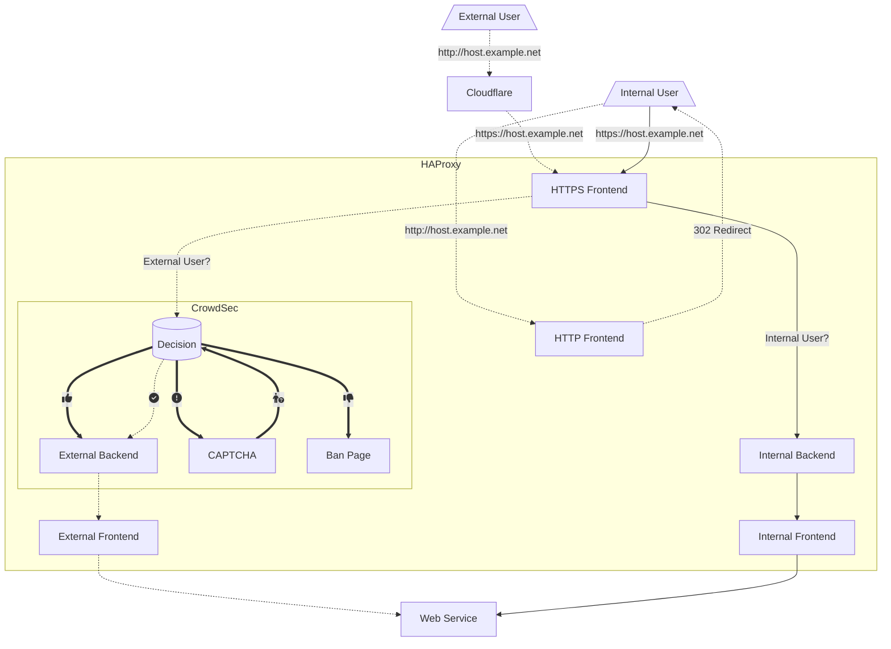

This is an explanation of my [HAProxy](https://www.haproxy.org) config, as a reminder for myself. This has evolved over time. Most recently I have added a redirection for external or internal traffic to backends. The reason for this was due to adding a [Jellyfin](https://jellyfin.org) server and I didn't want that running over [Cloudflare](https://www.cloudflare.com) if the connection was coming from the internal network.

> Update: I have now added [CrowdSec](https://www.crowdsec.net/) into the mix and increased security by using [CF-Connecting-IP](https://developers.cloudflare.com/fundamentals/get-started/reference/http-request-headers/#cf-connecting-ip) instead of X-Forwarded-For header for capturing client IPs. See [this article from Mozilla](https://developer.mozilla.org/en-US/docs/Web/HTTP/Headers/X-Forwarded-For) on why X-Forwarded-For header is insecure.
{: .prompt-info }

> Update 2: I have massively reduced the size of my configuration file by usings a map for backend selection.
{: .prompt-info }

> Update 3: Attempting to use IPv6 as much as possible.
{: .prompt-info }

> Update 4: Switched redirects from `localhost:port` to abstract namespaces i.e. `abns@namespace`.
{: .prompt-info }

# Traffic Flow

This shows how traffic flows internally or externally from the user to the services behind my HAProxy server.



# Breakdown

These are some brief explanations on important sections of my configuration. For an explanation of the important parts of the configuration in general; [This](https://www.haproxy.com/blog/the-four-essential-sections-of-an-haproxy-configuration) is an excellent write-up of how each section functions. My configuration in full is available at the bottom or you can click [HERE](#complete-configuration-file) to be taken to it.

## Global

In this section all the bits that globally apply to HAProxy are entered.

```bash
global
    log /dev/log local0
    log /dev/log local1 notice
    chroot /var/lib/haproxy
    stats socket /run/haproxy/admin.sock mode 660 level admin expose-fd listeners
    user haproxy
    group haproxy
    daemon
    maxconn 40000
    ulimit-n 81000
    crt-base /etc/haproxy/certificates/
```

Most of this is standard in an Ubuntu install of HAProxy. The only part I added was the base location for the certificates I use.

## Defaults

I only use a single defaults section since there are only a small amount of deviations from them in the frontends and backends.

```bash
defaults
    mode http
    option httplog
    option forwardfor
    option dontlognull
    log global
    timeout client 30s
    timeout server 30s
    timeout connect 5s
```

Because most of my frontends and backends use http mode I set it here.

All the rest is common configuration.

## Stats Page

I am using an almost default set-up for the listen for statistics page.

## Frontends

I have placed all the frontends together which might be a bit confusing. The confusing part is how the Redirect Frontend sends to a backend depending on IP, that then sends the traffic to frontends for internal or external traffic.

### HTTP Frontend

The first frontend I have configured is for redirecting HTTP to HTTPS and nothing more.

> If you bind to `:::80 v4v6` IPv4 will present as `::ffff:10.0.0.1` from headers. Doing it as `*:80,:::80 v6only` will render it correctly.
{: .prompt-tip }

```bash
frontend http-redirect
    bind *:80,:::80 v6only
    http-request redirect scheme https code 301
```

This is self explanatory.

### Redirect Frontend

The purpose of this frontend is to redirect the connection to a backend based on whether the connection is coming from my internal subnet. The reason I do this is because I am using Cloudflare as a proxy for connections to my services. Because of this I require the frontend from Cloudflare to use a [Cloudflare Origins](https://www.cloudflare.com/en-au/learning/cdn/glossary/origin-server) certificate, which will come up with a certificate error for internal users directly connecting to the HAProxy server. This was implemented due to traffic concerns because I set up a Jellyfin server. If I left it how I had it previously it would have meant looping a lot of traffic out to the Internet and then back in through Cloudflare.

```bash
# Frontend for redirecting traffic to the required frontend
frontend https-redirect
    bind *:443,:::443 v6only
    mode tcp
    option tcplog
    tcp-request inspect-delay 5s
    tcp-request content accept if { req_ssl_hello_type 1 }
    acl internal src 192.168.88.1/24
    acl internalv6 src 2001:db8:b00b::/48
    acl cloudflare src -f /etc/haproxy/CF_ips.lst
    use_backend cloudflare if cloudflare
    use_backend internal if internal OR internalv6
```

This is the default frontend and all traffic going to HTTPS will hit it. This one is configured for tcp mode as it does not need to see anything in the headers.

I have an ACL configured that matches my internal network range of 192.168.88.0/24

It will then redirect traffic to my internal backend (internal) if it matches the rule, otherwise it will send it to my external backend (cloudflare)

### Cloudflare Frontend

This frontend is the one that works with connections coming from Cloudflare. It has a Cloudflare Origins certificate associated with it.

> The Crowsec configuration is slightly modified from their recommendations. I have an [issue](https://github.com/crowdsecurity/cs-haproxy-bouncer/issues/13) submitted with them around detecting client IPs in a different way to support other configurations.

As quoted above I went about this in the most complicated way, when all I needed to do was set CF-Connecting-IP to the source IP. This is how I have done it, thanks to the devs for the bouncer.

> [Abstract namespaces](https://docs.haproxy.org/2.6/configuration.html#11.1) only work on Linux. You will not be able to use this config on [OPNsense](https://opnsense.org) or other BSD configurations. You can use `localhost:port` and select an unused port.
{: .prompt-danger}

```bash
# Frontend for external users that a connecting through Cloudflare
frontend cloudflare
    bind abns@cloudflare accept-proxy ssl crt example.net.pem

    # CloudFlare CF-Connecting-IP header to source IP for Crowdsec decisions
    http-request set-src req.hdr(CF-Connecting-IP)

    # Crowdsec bouncer
    stick-table type ip size 10k expire 30m # declare a stick table to cache captcha verifications
    http-request lua.crowdsec_allow # action to identify crowdsec remediation
    http-request track-sc0 src if { var(req.remediation) -m str "captcha-allow" } # cache captcha allow decision
    http-request redirect location %[var(req.redirect_uri)] if { var(req.remediation) -m str "captcha-allow" } # redirect to initial url
    http-request use-service lua.reply_captcha if { var(req.remediation) -m str "captcha" } # serve captcha template if remediation is captcha
    http-request use-service lua.reply_ban if { var(req.remediation) -m str "ban" } # serve ban template if remediation is ban

    # Select backend based on services.map file or use backend no-match if not found.
    use_backend %[req.hdr(host),lower,map(/etc/haproxy/services.map,no-match)]
```

The example.net.pem is the Cloudflare origins certificate.

Backends are selected based on an SNI match for each ACL.

If it doesn't match any of the ACLs it will send it to a backend that shows a failure page.

### Internal Frontend

This frontend can be a mirror of the External Frontend if you want all internal connection to come through it. This is using the same map as the cloudflare frontend.

```bash
frontend internal
    bind abns@internal accept-proxy ssl crt int.example.net.pem

    # Select backend based on services.map file or use backend no-match if not found.
    use_backend %[req.hdr(host),lower,map(/etc/haproxy/services.map,no-match)]
```

The certificate is a wildcard certificate that I auto-generate with [Let's Encrypt](https://letsencrypt.org).

The bind line is the only part different from Cloudflare Frontend. Every other line can be set identically to the Cloudflare Frontend.

You will need to create a file named `/etc/haproxy/services.map` and enter in the host to backend information. The first part is the FQDN of the host and the second is the backend name. Example as follows (I have only listed a few and not all backends shown in the config).

```bash
recipes.example.net recipes
jellyfin.example.net jellyfin
paperless.example.net paperless
```

## Backends

### Redirect Backends

These are the backends that redirect traffic to the necessary frontends based on the certificate that needs to be supplied. This uses the proxy protocol (send-proxy-v2) to make sure the IP is passed through to the backends. The frontends accept the proxy protocol.

```bash
# Redirect to frontend based on internal or external connections
backend cloudflare
    mode tcp
    server loopback-for-tls abns@cloudflare send-proxy-v2

backend internal
    mode tcp
    server loopback-for-tls abns@internal send-proxy-v2
```

These are set to tcp mode as they don't need to see headers.

### Normal Backends

The remaining backends are pretty standard. There is nothing special that needs to be explained there.

## Complete Configuration File

```bash
global
    log /dev/log local0
    log /dev/log local1 notice
    chroot /var/lib/haproxy
    stats socket /run/haproxy/admin.sock mode 660 level admin expose-fd listeners
    user haproxy
    group haproxy
    daemon
    maxconn 40000
    ulimit-n 81000
    crt-base /etc/haproxy/certificates/

    # Crowdsec bouncer
    lua-prepend-path /usr/lib/crowdsec/lua/haproxy/?.lua
    lua-load /usr/lib/crowdsec/lua/haproxy/crowdsec.lua
    setenv CROWDSEC_CONFIG /etc/crowdsec/bouncers/crowdsec-haproxy-bouncer.conf

defaults
    mode http
    option httplog
    option forwardfor
    option dontlognull
    log global
    timeout client 30s
    timeout server 30s
    timeout connect 5s
    errorfile 400 /etc/haproxy/errors/400.http
    errorfile 403 /etc/haproxy/errors/403.http
    errorfile 408 /etc/haproxy/errors/408.http
    errorfile 500 /etc/haproxy/errors/500.http
    errorfile 502 /etc/haproxy/errors/502.http
    errorfile 503 /etc/haproxy/errors/503.http
    errorfile 504 /etc/haproxy/errors/504.http

listen stats
    bind *:8404
    stats enable
    stats hide-version
    stats realm Haproxy\ Statistics
    stats uri /haproxy_stats
    stats auth HAProxy:Password

# Frontend to redirect HTTP to HTTPS with code 301
frontend http-redirect
    bind *:80,:::80 v6only
    http-request redirect scheme https code 301

# Frontend for redirecting traffic to the required frontend
frontend https-redirect
    bind *:443,:::443 v6only
    mode tcp
    option tcplog
    tcp-request inspect-delay 5s
    tcp-request content accept if { req_ssl_hello_type 1 }
    acl internal src 192.168.88.1/24
    acl internalv6 src 2001:db8:b00b::/48
    acl cloudflare src -f /etc/haproxy/CF_ips.lst
    use_backend cloudflare if cloudflare
    use_backend internal if internal OR internalv6

# Frontend for external users that a connecting through Cloudflare
frontend cloudflare
    bind abns@cloudflare accept-proxy ssl crt example.net.pem

    # CloudFlare CF-Connecting-IP header to source IP for Crowdsec decisions
    http-request set-src req.hdr(CF-Connecting-IP)

    # Crowdsec bouncer
    stick-table type ip size 10k expire 30m # declare a stick table to cache captcha verifications
    http-request lua.crowdsec_allow # action to identify crowdsec remediation
    http-request track-sc0 src if { var(req.remediation) -m str "captcha-allow" } # cache captcha allow decision
    http-request redirect location %[var(req.redirect_uri)] if { var(req.remediation) -m str "captcha-allow" } # redirect to initial url
    http-request use-service lua.reply_captcha if { var(req.remediation) -m str "captcha" } # serve captcha template if remediation is captcha
    http-request use-service lua.reply_ban if { var(req.remediation) -m str "ban" } # serve ban template if remediation is ban

    # Select backend based on services.map file or use backend no-match if not found.
    use_backend %[req.hdr(host),lower,map(/etc/haproxy/services.map,no-match)]

# Frontend for internal users connecting directly to HAProxy
frontend internal
    bind abns@internal accept-proxy ssl crt int.example.net.pem

    # Select backend based on services.map file or use backend no-match if not found.
    use_backend %[req.hdr(host),lower,map(/etc/haproxy/services.map,no-match)]
    
# Redirect to frontend based on internal or external connections
backend cloudflare
    mode tcp
    server loopback-for-tls abns@cloudflare send-proxy-v2

backend internal
    mode tcp
    server loopback-for-tls abns@internal send-proxy-v2

# Normal Backends
backend no-match
    http-request deny deny_status 403

backend recipes
    server recipes recipes.lxd:8002 check

backend keycloak
    server keycloak keycloak.lxd:8080 check

backend guac
    server guac guacamole.lxd:8080 check

backend phpmyadmin
    # Set root path for redirect
    acl path_root path /
    # Redirect to phpmyadmin subdirectory
    redirect location https://phpmyadmin.example.net/phpmyadmin if path_root
    server phpmyadmin phpmyadmin.lxd:80 check

backend bookstack
    server bookstack bookstack.lxd:80 check

backend pgadmin
    # Set root path for redirect
    acl path_root path /
    # Redirect to pgadmin4 subdirectory
    redirect location https://pgadmin.example.net/pgadmin4 if path_root
    server pgadmin pgadmin.lxd:80 check

backend pi-hole
    server pi-hole pi-hole.lxd:80 check

backend paperless
    server paperless paperless.lxd:8000 check

backend jellyfin
    server jellyfin jellyfin.lxd:8096 check
    
# Backend for google to allow DNS resolution if using reCAPTCHA
backend captcha_verifier
    server captcha_verifier www.google.com:443 check

# Backend for crowdsec to allow DNS resolution
backend crowdsec
    server crowdsec ::1:8080 check
```
