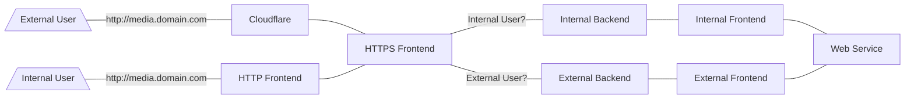

This is an explanation of my HAProxy config, mostly as a reminder for myself. This has evolved over time. Most recently I have added a redirection for external or internal traffic to backends. The reason for this was due to adding a Jellyfin server and I didn't want that running over Cloudflare if the connection was coming from the internal network.

Here is a copy of my HAProxy config in full

```bash
global
    log /dev/log local0
    log /dev/log local1 notice
    chroot /var/lib/haproxy
    stats socket /run/haproxy/admin.sock mode 660 level admin expose-fd listeners
    user haproxy
    group haproxy
    daemon
    maxconn 40000
    ulimit-n 81000
    crt-base /etc/haproxy/certificates/

defaults
    mode http
    option httplog
    option dontlognull
    option forwardfor
    log global
    timeout client 30s
    timeout server 30s
    timeout connect 5s

listen stats
    bind *:8404
    stats enable
    stats hide-version
    stats realm Haproxy\ Statistics
    stats uri /haproxy_stats
    stats auth HAProxy:Password

frontend fe_http
    bind *:80

    # Redirect HTTP to HTTPS with code 301
    http-request redirect scheme https code 301

# Frontend for SNI Passthrough
frontend fe_redirect
    bind *:443
    mode tcp
    tcp-request inspect-delay 5s
    tcp-request content accept if { req_ssl_hello_type 1 }

    acl int_net src 192.168.88.1/24

    use_backend be_int if int_net
    default_backend be_ext

frontend fe_ext
    bind *:7000 ssl crt domain.com.pem

    acl bookstack ssl_fc_sni bookstack.domain.com
    acl phpmyadmin ssl_fc_sni phpmyadmin.domain.com
    acl guac ssl_fc_sni guac.domain.com
    acl recipes ssl_fc_sni recipes.domain.com
    acl keycloak ssl_fc_sni accounts.domain.com
    acl pgadmin ssl_fc_sni pgadmin.domain.com
    acl pi-hole ssl_fc_sni pi-hole.domain.com
    acl paperless ssl_fc_sni paperless.domain.com
    acl jellyfin ssl_fc_sni media.domain.com

    use_backend be_bookstack if bookstack
    use_backend be_phpmyadmin if phpmyadmin
    use_backend be_guac if guac
    use_backend be_recipes if recipes
    use_backend be_keycloak if keycloak
    use_backend be_pgadmin if pgadmin
    use_backend be_pi-hole if pi-hole
    use_backend be_paperless if paperless
    use_backend be_jellyfin if jellyfin

    # This redirects to a failure page
    default_backend be_no-match

frontend fe_int
    bind *:7001 ssl crt int.domain.com.pem

    acl jellyfin ssl_fc_sni media.domain.com

    use_backend be_jellyfin if jellyfin

    # This redirects to a failure page
    default_backend be_no-match

# Redirect to frontend based on internal or external connections
backend be_ext
    mode tcp
    server localhost 127.0.0.1:7000 check

backend be_int
    mode tcp
    server localhost 127.0.0.1:7001 check

# Normal Backends
backend be_no-match
    http-request deny deny_status 403

backend be_recipes
    server recipes recipes.lxd:8002 check

backend be_keycloak
    server keycloak keycloak.lxd:8080 check

backend be_guac
    server guac guacamole.lxd:8080 check

backend be_phpmyadmin
    server mariadb phpmyadmin.lxd:80 check

backend be_bookstack
    server bookstack bookstack.lxd:80 check

backend be_pgadmin
    server pgadmin pgadmin.lxd:80 check

backend be_pi-hole
    server pi-hole pi-hole.lxd:80 check

backend be_paperless
    server paperless paperless.lxd:8000 check

backend be_jellyfin
    server jellyfin jellyfin.lxd:8096 check
```
# Traffic Flow



# Breakdown

### Global

In this section all the bits that globally apply to HAProxy are entered.

```bash
global
    log /dev/log local0
    log /dev/log local1 notice
    chroot /var/lib/haproxy
    stats socket /run/haproxy/admin.sock mode 660 level admin expose-fd listeners
    user haproxy
    group haproxy
    daemon
    maxconn 40000
    ulimit-n 81000
    crt-base /etc/haproxy/certificates/
```

Most of this is standard in a Ubuntu install of HAProxy. The only part I added was the base location for the certificates I use.

### Defaults

I only use a single defaults section since there are only a small amount of deviations from them in the frontends and backends.

```bash
defaults
    mode http
    option httplog
    option dontlognull
    option forwardfor
    log global
    timeout client 30s
    timeout server 30s
    timeout connect 5s
```

Because most of my frontends and backends use http mode I set it here, along with other http based options like "forwardfor"

All the rest is common configuration.

### Stats Page

I am using an almost default set-up for the listen for statistics page.

## Frontends

I have placed all the frontends together which might be a bit confusing. The confusing part is how the Redirect Frontend sends to a backend depending on IP, that then sends the traffic to frontends for internal or external traffic.

### HTTP Frontend

The first frontend I have configured is for redirecting HTTP to HTTPS and nothing more.

```bash
frontend fe_http
    bind *:80

    # Redirect HTTP to HTTPS with code 301
    http-request redirect scheme https code 301
```

This is self explanatory.

### Redirect Frontend

The purpose of this frontend is to redirect the connection to a backend based on whether the connection is coming from my internal subnet. The reason I do this is because I am using Cloudflare as a proxy for connections to my services. Because of this I require the frontend from Cloudflare to use a Cloudflare Origins certificate, which will come up with a certificate error for internal users directly connecting to the HAProxy server. This was implemented due to traffic concerns because I set up a Jellyfin server. If I left it how I had it previously it would have meant looping a lot of traffic out to the Internet and then back in through Cloudflare.

```bash
# Frontend to redirect based on IP range
frontend fe_redirect
    bind *:443
    mode tcp
    tcp-request inspect-delay 5s
    tcp-request content accept if { req_ssl_hello_type 1 }

    acl int_net src 192.168.88.0/24

    use_backend be_int if int_net
    default_backend be_ext
```

This is the default frontend and all traffic going to HTTPS will hit it. This one is configured for tcp mode as it does not need to see anything in the headers.

I have an acl configured that matches my internal network range of 192.168.88.0/24

It will then redirect traffic to my internal backend (be_int) if it matches the rule, otherwise it will send it to my external backend (be_ext)

### External Frontend

This frontend is the one that works with connections coming from Cloudflare. It has a Cloudflare Origins certificate associated with it.

```bash
frontend fe_ext
    bind *:7000 ssl crt domain.com.pem

    acl bookstack ssl_fc_sni bookstack.domain.com
    acl phpmyadmin ssl_fc_sni phpmyadmin.domain.com
    acl guac ssl_fc_sni guac.domain.com
    acl recipes ssl_fc_sni recipes.domain.com
    acl keycloak ssl_fc_sni accounts.domain.com
    acl pgadmin ssl_fc_sni pgadmin.domain.com
    acl pi-hole ssl_fc_sni pi-hole.domain.com
    acl paperless ssl_fc_sni paperless.domain.com
    acl jellyfin ssl_fc_sni media.domain.com

    use_backend be_bookstack if bookstack
    use_backend be_phpmyadmin if phpmyadmin
    use_backend be_guac if guac
    use_backend be_recipes if recipes
    use_backend be_keycloak if keycloak
    use_backend be_pgadmin if pgadmin
    use_backend be_pi-hole if pi-hole
    use_backend be_paperless if paperless
    use_backend be_jellyfin if jellyfin

    # This redirects to a failure page
    default_backend be_no-match
```

This frontend is bound to port 7000. You can use any port that you want. There is not good reason that I chose 7000. The domain.com.pem is the Cloudflare origins certificate.

Backends are selected based on an SNI match for each acl.

If it doesn't match any of the ACLs it is will send it to a backend that shows a failure page.

### Internal Frontend

This frontend can be a mirror of the External Frontend if you want all internal connection to come through it. I currently on have Jellyfin passed to it internally due to data requirements. All the other services I am using, I am not concerned about data usage.

```bash
frontend fe_int
    bind *:7001 ssl crt int.domain.com.pem

    acl jellyfin ssl_fc_sni media.domain.com

    use_backend be_jellyfin if jellyfin

    # This redirects to a failure page
    default_backend be_no-match
```

This frontend is bound to 7001, simply because it is the next number on from the External Frontend. The certificate is a wildcard certificate that I auto-generate with Let's Encrypt.

The bind line is the only part different from External Frontend.

## Backends

### Redirect Backends

These are the backends that redirect traffic to the necessary frontends based on the certificate that needs to be supplied.

```bash
# Redirect to frontend based on internal or external connections
backend be_ext
    mode tcp
    server localhost 127.0.0.1:7000 check

backend be_int
    mode tcp
    server localhost 127.0.0.1:7001 check
```

These are set to tcp mode as they don't need to see headers. They are sent to the loopback address of the server so that they then connect to the frontends running on port 7000 or 7001.

### Normal Backends

The remaining backends are normal ones. There is nothing special that needs to be explained there.
